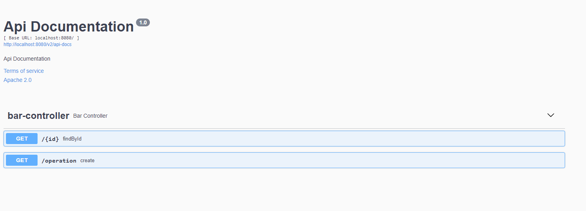

# API-Bar
## Autor
**Nikolai Bermudez Vega**  
## Resumen
Se debe exponer un API que reciba un numero de iteraciones Q y un número del 1 al 5 que
representara el id de la pila de datos a trabajar (script de DB entregados) y entregue el array de
respuesta

## Prerequisitos
Tener instalado:
- Java 1.8.
- Maven 3.8.4
- Postman 9.11.

Entender sobre peticiones http, servidores y demás, así como el lenguaje JAVA en el que fue realizado este proyecto.


## ¿Cómo usar el aplicativo?
Descargue o clone el repositorio con el siguiente comando.

    git clone https://github.com/Nikolai9906/API-bar-test

- Luego abra el proyecto con su entorno de desarrollo preferido
- Compile las dependecias que Maven pedira para la ejecucion del proyecto
- Por ultimo corralo con ayuda del entorno de desarrollo para tener el ambiente Backend en funcionamiento, o por medio del siguiente comando:
```
./mvnw spring-boot:run
```

## Peticiones de la API
Podremos realizar distintas peticiones de acuerdo a lo requerido por el usuario, hay que tener en cuenta que el proyecto funciona con Spring Security y muchas de las peticiones requieren un token de autenticacion
- **GET**
:  En este caso veremos la prueba de la peticions GET por medio de la herramienta POSTMAN

## Pruebas
### GET
```
http://localhost:8080/operation?iteration=3&idArray=5
```


## Documentacion API
[Swagger](http://localhost:8080/swagger-ui/index.html) Herramienta de documentacion para servicio web RESTful

    http://localhost:8080/swagger-ui/index.html



## Arquitectura
De acuerdo al problema desarrollado se crearon diferentes paquetes para cumplir con las funcionalidades requeridas por el ejercicio. De igual 
forma se crearon otros paquetes de manera de que si se quiera extender y agregar diferentes funcionalidades, se pueda trabajar organizadamente
sin modificar la estructura y orden del proyecto.
```
└───com
    └───aldeamo
        └───bar
            ├───config
            ├───controller
            ├───data
            ├───dto
            ├───repository
            └───service
                └───impl

```
## Tecnologias y herramientas

- [Spring Boot](https://spring.io/projects/spring-boot) herramienta que nos permite crear un proyecto como con Spring Framework, solo que Spring Boot elimina ciertas configuraciones repetitivas requeridas para desplegar la aplicación o proyecto.
- [Swagger](https://swagger.io/docs/) conjunto de herramientas de software de código abierto para diseñar, construir, documentar, y utilizar servicios web RESTful.

## Construido
- [IntelliJ](https://www.jetbrains.com/es-es/idea/) Editor de JAVA donde se puede compilar el proyecto.

- [Maven](https://maven.apache.org) Administrador de dependencias.

- [Postman](https://www.postman.com) Aplicacion de pruebas API.

## Licencia
Este programa es de uso libre, puede ser usado por cualquier persona.

Los terminos de la licencia se pueden encontrar en el siguiente archivo [License](LICENSE).
